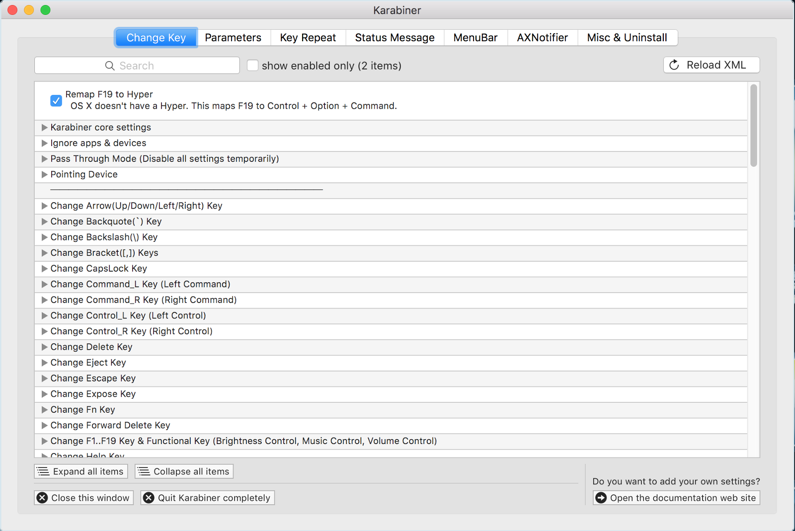
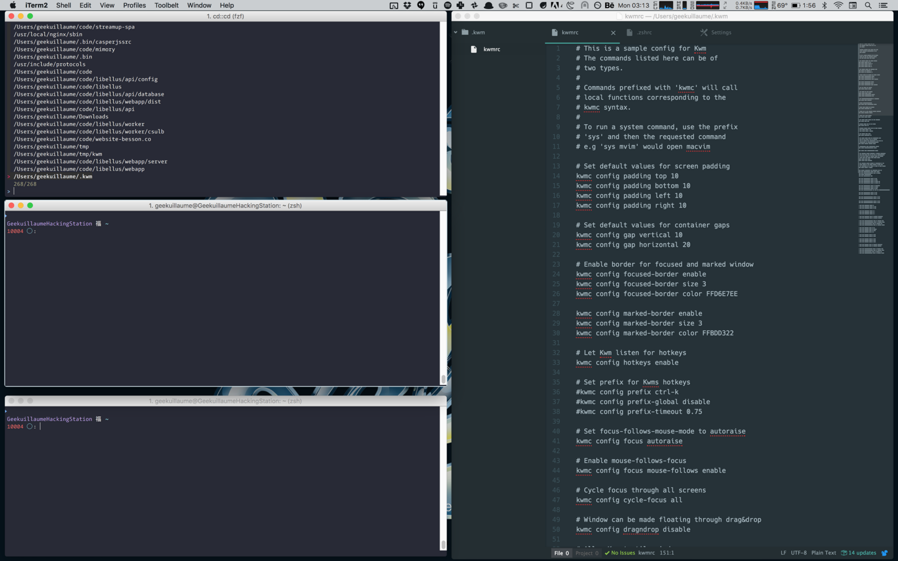
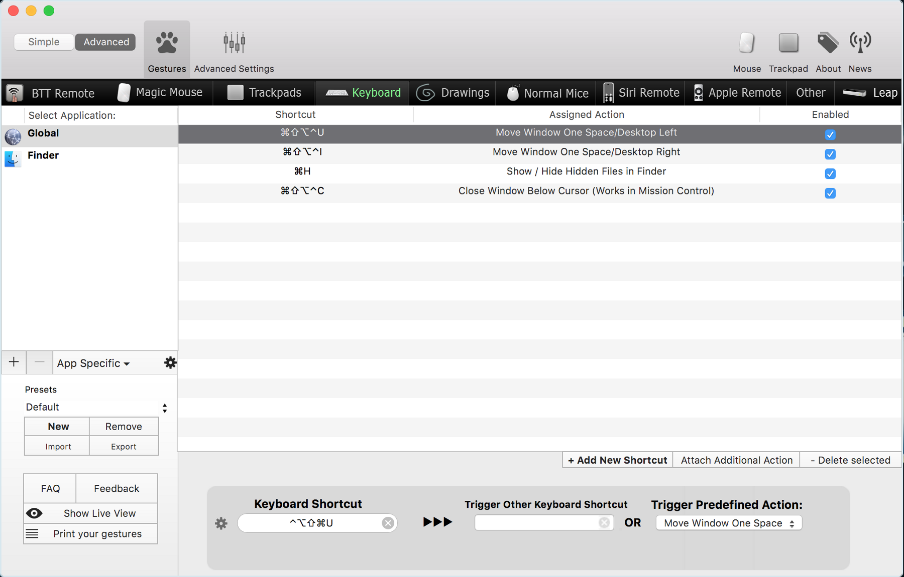
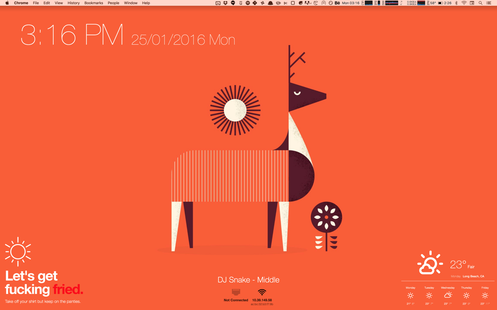
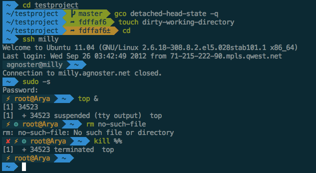
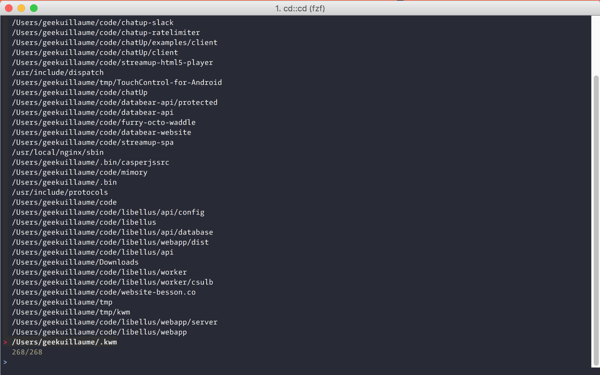
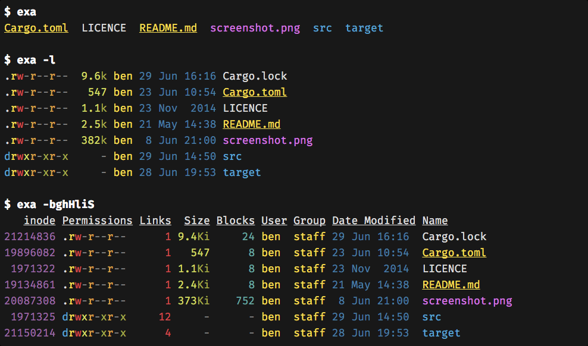
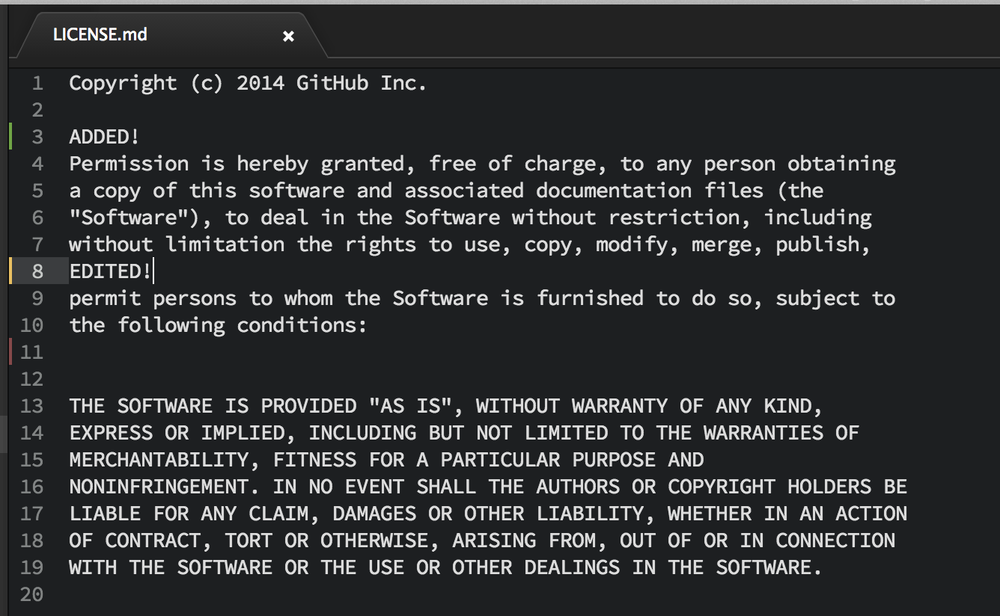
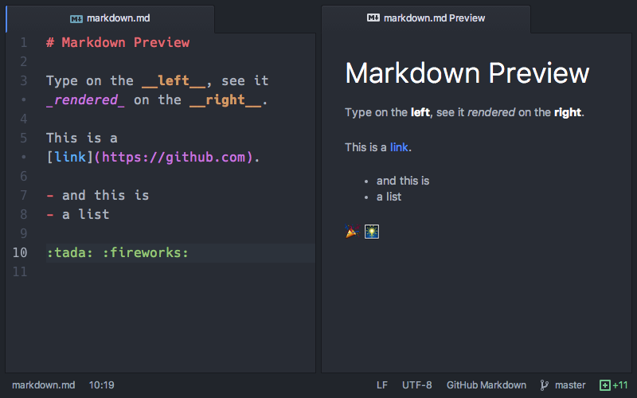
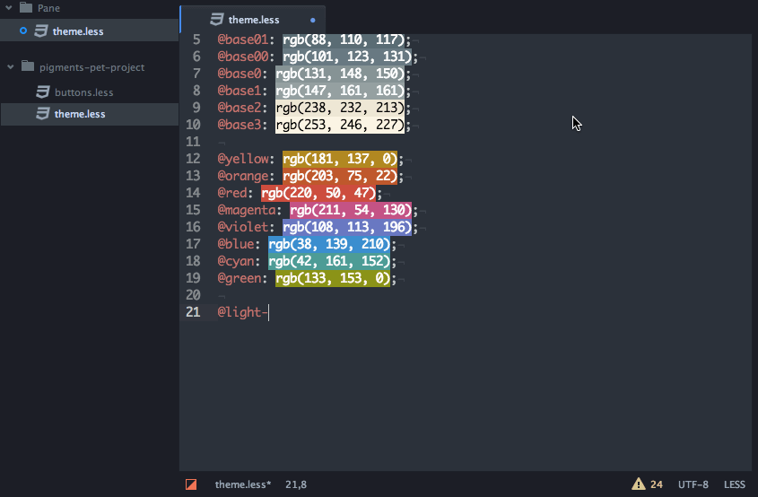

A month ago, my amazing client, [Streamup](https://streamup.com/) kindly gave me a Macbook Pro, and my experience was catastrophic.

You see, I’m the kind of developer who used Linux for every-day task and tried every new shiny project to increase his productivity and pleasure to code. I’ve spent way too much time tweaking my AwesomeWM config, testing SublimeText and Atom plugins and adding shell aliases.

So when I got this brand new computer, I was left with a environment made for simplicity and not optimized for a developer usage.

A lot of persons don’t want to spend time tweaking everything, I completely understand that, so here’s the apps I highly recommend you to try!

## OSX

### Caps Lock to Hyper (Cmd + Alt + Ctrl)

The Caps Lock key is completely useless. I never use it but it’s here, always under my little finger.

In OSX, the best usage for it is to remap it to the Hyper combination. This is rarely used so you can then use the Caps Lock key for your system-wide shortcuts.

It’s quite simple to remap it, simply read this [good article from Brett Terpstra](http://brettterpstra.com/2012/12/08/a-useful-caps-lock-key/).

### Karabiner

[Karabiner](https://pqrs.org/osx/karabiner/) is a free app to simply alter the comportment of your keyboard. I only use it to remap Fn to Control but there is much more options you could use if you like.

### KWM

[KWM](https://github.com/koekeishiya/kwm) is a tiling window manager that work remarkably well. I tried several (using [Amethyst](https://github.com/ianyh/Amethyst) for a long time) but KWM is faster, more reliable and easier to use than all the others.

One of the best feature is Raise-On-Hover, with this you don’t need to click in a window to start typing in it. It saves hundred of clicks each day, for real.

I only uses Caps Lock (remapped to Hyper) for the KWM keybinding.

### BetterTouchTool

[BetterTouchTool](http://www.boastr.net/) is the swiss knife of shortcuts. You need to buy a licence to use it ($3).

Personally, I only uses 4 shortcuts:
- Move window to left/right space
- Toggle hidden files in Finder
- Close focused window

### Eye candy

I’m a huge [Dribbble](https://dribbble.com/) and [Behance](https://www.behance.net/) fan so it was logic to get my wallpapers from there. Unfortunately, I could only find an [app for Behance](https://itunes.apple.com/us/app/wallpaper-by-behance/id885319628?mt=12) that switch the background every X hours.

If you’re more a photography lover, you should also take a look at [Irvue](https://itunes.apple.com/us/app/irvue-unsplash-wallpapers/id1039633667?mt=12) that source its images from [Unsplash](https://unsplash.com/).

[Übersicht](http://tracesof.net/uebersicht/) creates the widgets on the screen. It’s really easy to install and to add widgets, you simply need to download and extract a folder from the [online gallery](http://tracesof.net/uebersicht-widgets/) to the Übersicht directory.

## Shell

### [ZSH + Oh My ZSH](https://github.com/robbyrussell/oh-my-zsh)

Replace your basic shell with a much more powerful one.

Just answer the questions asked when you first use it to customize it to your needs.
Then choose from the myriad of [themes available](https://github.com/robbyrussell/oh-my-zsh/wiki/themes) and activate some very useful [plugins](https://github.com/robbyrussell/oh-my-zsh/wiki/Plugins).

Here’s the plugins I cannot live without:
- [Syntax highlighting](https://github.com/zsh-users/zsh-syntax-highlighting) (unknown commands in red, quoted text in yellow)
- [Double escape to sudo](https://github.com/robbyrussell/oh-my-zsh/wiki/Plugins#sudo)
- [History substring search](https://github.com/zsh-users/zsh-history-substring-search) (press up to get the last command matching)
- [OSX](https://github.com/robbyrussell/oh-my-zsh/wiki/Plugins#osx) (cdf to cd in finder directory)
- [Extract](https://github.com/robbyrussell/oh-my-zsh/blob/master/plugins/extract/extract.plugin.zsh) (x [file] to decompress every type of file)
- [Brew](https://github.com/robbyrussell/oh-my-zsh/wiki/Plugins#brew), [Docker](https://github.com/robbyrussell/oh-my-zsh/wiki/Plugins#docker), [Git](https://github.com/robbyrussell/oh-my-zsh/wiki/Plugins#git) to add smart auto-completion

### Enhancd

[Enhancd](https://github.com/b4b4r07/enhancd) replace your cd command with an interactive list of your last directories to choose from.

You can start typing to fuzzy search the list and then just enter to change your current directory with the one selected.

### Exa

[Exa](http://bsago.me/exa/) is a smarter ls, nothing more to say.

## Atom

I’ve switched from Sublime Text 3 to Atom a couple of month ago. I will not explain here the reasons, here’s simply some plugins I use everyday.

### [Atom Beautify](https://atom.io/packages/atom-beautify)

Reindent your file or selection with a keybinding. Life saving.

### [Git Diff](https://github.com/atom/git-diff)

Add color corresponding to the git diff of the current file in the gutter.

It makes me separate my modifications in more smaller commits.

### [Markdown Preview](https://github.com/atom/markdown-preview)

Do I need to say more ?

### [Pigments](https://github.com/abe33/atom-pigments)

Adds color in your code.

Smart enough to work with SASS functions.

### Language / Framework specific packages

Everyday, I use the [React](https://atom.io/packages/react) and [Typescript](https://atom.io/packages/atom-typescript) plugins that are highly useful. If you use other languages or frameworks you should search for a related plugin to improve your experience in Atom.

## Next?

There is still a lot of things that can be improved and I haven’t found a solution. The biggest one lacking is a real Guake terminal (iTerm2 only does it on a single space).

If you think something is missing, comment this article on [HackerNews](https://news.ycombinator.com/item?id=10971201)!